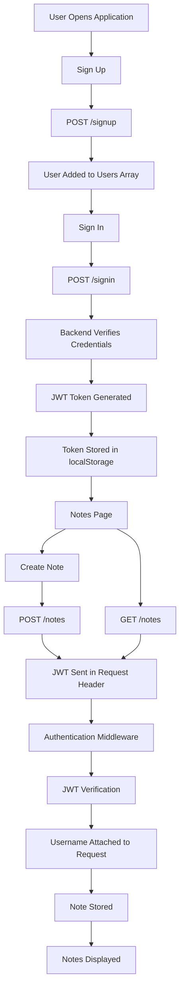
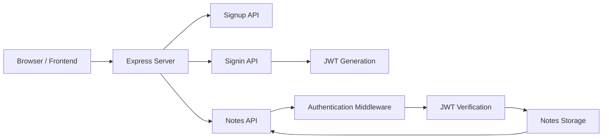
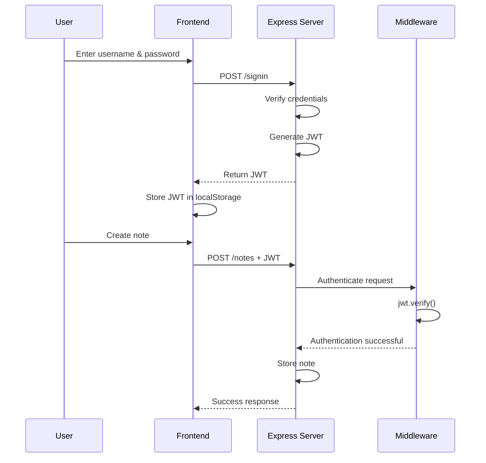

# 📝 Notes App with JWT Authentication

A beginner-friendly full-stack Notes Application built using **Node.js, Express.js, JavaScript, HTML, CSS, Axios, and JSON Web Tokens (JWT)**.

The application allows users to:

* Create an account
* Sign in securely using username and password
* Receive a JWT authentication token
* Store the JWT in browser `localStorage`
* Create personal notes
* Retrieve their own notes
* Protect note-related API endpoints using authentication middleware

---

## 🚀 Project Overview

This project demonstrates how authentication works in a full-stack web application.

A user first signs up and then signs in. During sign-in, the backend generates a **JSON Web Token (JWT)**.

The token is stored in the browser's `localStorage` and is sent with requests to protected endpoints.

The backend uses authentication middleware to verify the JWT before allowing the user to create or retrieve notes.

### Complete Application Flow



---

# ✨ Features

### 🔐 Authentication

* User registration
* User login
* JWT-based authentication
* Protected API routes
* Authentication middleware

### 📝 Notes

* Create notes
* Retrieve notes
* Display notes belonging to the logged-in user

### 🌐 Frontend

* Simple HTML interface
* Axios for API requests
* Browser `localStorage` for JWT storage
* Dynamic note rendering using JavaScript DOM manipulation

### ⚙️ Backend

* Node.js
* Express.js
* REST API endpoints
* JWT authentication
* In-memory data storage

---

# 🛠️ Technologies Used

| Technology           | Purpose                      |
| -------------------- | ---------------------------- |
| HTML                 | Frontend structure           |
| CSS                  | Basic styling                |
| JavaScript           | Frontend logic               |
| Axios                | Sending HTTP requests        |
| Node.js              | JavaScript runtime           |
| Express.js           | Backend web framework        |
| JSON Web Token (JWT) | Authentication               |
| localStorage         | Storing authentication token |

---

# 📁 Project Structure

```text
Notes-app-Authentication/
│
├── index.js
│
├── middleware.js
│
├── package.json
├── package-lock.json
│
└── frontend/
    │
    ├── index.html
    ├── signup.html
    └── signin.html
```

### File Description

| File                   | Purpose                                |
| ---------------------- | -------------------------------------- |
| `index.js`             | Main Express server and API routes     |
| `middleware.js`        | JWT authentication middleware          |
| `frontend/index.html`  | Notes page                             |
| `frontend/signup.html` | User registration page                 |
| `frontend/signin.html` | User login page                        |
| `package.json`         | Project dependencies and configuration |

---

# 🏗️ Application Architecture



---

# 🔐 Authentication Architecture

The application uses JWT authentication.



---

# 🔑 How JWT Authentication Works

## 1. User Signs In

The frontend sends:

```http
POST /signin
```

with:

```json
{
    "username": "Nani",
    "password": "2003"
}
```

---

## 2. Backend Generates JWT

The backend verifies the credentials and generates a token:

```javascript
const token = jwt.sign(
    {
        username: username
    },
    "na203"
);
```

The backend sends the token back to the frontend.

---

## 3. Token is Stored

The frontend receives the token:

```javascript
const token = response.data.token;
```

and stores it:

```javascript
localStorage.setItem("token", token);
```

---

## 4. User Creates a Note

When the user clicks **Create new note**, the frontend sends:

```http
POST /notes
```

The JWT is included in the request header:

```javascript
headers: {
    token: localStorage.getItem("token")
}
```

---

## 5. Middleware Verifies the Token

The authentication middleware gets the token:

```javascript
const token = req.headers.token;
```

Then verifies it:

```javascript
const decoded = jwt.verify(token, "na203");
```

The username is extracted:

```javascript
const username = decoded.username;
```

and attached to the request:

```javascript
req.username = username;
```

Finally:

```javascript
next();
```

allows the request to continue to the notes route.

---

# 🔄 Authentication Flow

```text
                    USER
                     │
                     ▼
              ┌─────────────┐
              │   Sign Up   │
              └──────┬──────┘
                     │
                     ▼
                POST /signup
                     │
                     ▼
               User Created
                     │
                     ▼
              ┌─────────────┐
              │   Sign In   │
              └──────┬──────┘
                     │
                     ▼
                POST /signin
                     │
                     ▼
                JWT Created
                     │
                     ▼
            Store JWT in Browser
               localStorage
                     │
                     ▼
              ┌─────────────┐
              │ Notes Page  │
              └──────┬──────┘
                     │
             Create / Get Notes
                     │
                     ▼
             JWT in Headers
                     │
                     ▼
          Authentication Middleware
                     │
                     ▼
                jwt.verify()
                     │
                     ▼
             User Authenticated
                     │
                     ▼
                Notes API
```

---

# 📡 API Endpoints

## 1. Sign Up

```http
POST /signup
```

### Request

```json
{
    "username": "nani",
    "password": "2003"
}
```

### Successful Response

```json
{
    "message": "You have signed up"
}
```

---

## 2. Sign In

```http
POST /signin
```

### Request

```json
{
    "username": "nani",
    "password": "2003"
}
```

### Successful Response

```json
{
    "token": "JWT_TOKEN"
}
```

---

## 3. Create Note

```http
POST /notes
```

### Request Body

```json
{
    "note": "Learn Node.js"
}
```

### Request Header

```text
token: JWT_TOKEN
```

### Successful Response

```json
{
    "message": "Done!"
}
```

---

## 4. Get Notes

```http
GET /notes
```

### Request Header

```text
token: JWT_TOKEN
```

### Successful Response

```json
{
    "notes": [
        {
            "note": "Learn Node.js",
            "username": "nani"
        }
    ]
}
```

---

# 🌐 Frontend Pages

## Signup Page

```text
/signup
```

Used to create a new user account.

---

## Signin Page

```text
/signin
```

Used to authenticate an existing user.

After successful authentication, the JWT is stored in the browser.

---

## Notes Page

```text
/
```

Used to:

* Create notes
* Display existing notes
* Retrieve notes from the backend

---

# 🧩 Important Concepts Demonstrated

This project demonstrates several important full-stack development concepts.

### Express.js

Used to create the backend server and API routes.

### REST APIs

The application uses HTTP methods such as:

```text
POST
GET
```

### Axios

Axios is used by the frontend to communicate with the backend.

Example:

```javascript
axios.post("/signin", {
    username,
    password
});
```

### Middleware

Middleware runs between the incoming request and the final route handler.

```text
Request
   ↓
Middleware
   ↓
Route
   ↓
Response
```

### JWT

JWT is used to authenticate users without sending the username and password with every request.

### localStorage

The browser stores the JWT:

```javascript
localStorage.setItem("token", token);
```

and retrieves it later:

```javascript
localStorage.getItem("token");
```

### DOM Manipulation

JavaScript dynamically creates note elements:

```javascript
document.createElement("div");
```

and adds them to the page:

```javascript
appendChild();
```

---

# 💻 How to Run This Project on Another Computer

Anyone can clone this project from GitHub and run it on their own computer.

## Prerequisites

Install:

* Node.js
* npm
* Git
* VS Code (recommended)

Check Node.js:

```bash
node --version
```

Check npm:

```bash
npm --version
```

Check Git:

```bash
git --version
```

---

# 📥 Installation

## Step 1: Clone the Repository

```bash
git clone YOUR_GITHUB_REPOSITORY_URL
```

For example:

```bash
git clone https://github.com/your-username/Notes-app-Authentication-app.git
```

Then enter the project:

```bash
cd Notes-app-Authentication-app
```

---

## Step 2: Install Dependencies

Run:

```bash
npm install
```

This installs the dependencies listed in `package.json`.

The main dependencies are:

```text
express
jsonwebtoken
```

Axios is loaded through a CDN in the frontend.

---

## Step 3: Start the Server

Run:

```bash
node index.js
```

The Express server will start on:

```text
http://localhost:3000
```

---

# 🌐 Open the Application

Open your browser and visit:

```text
http://localhost:3000/signup
```

Create an account.

Then sign in at:

```text
http://localhost:3000/signin
```

After successful login, you will be redirected to:

```text
http://localhost:3000/
```

You can now create and view notes.

---

# 🧪 How to Test the Application

Follow this sequence:

```text
1. Open /signup
        ↓
2. Create an account
        ↓
3. Open /signin
        ↓
4. Sign in
        ↓
5. JWT is stored in localStorage
        ↓
6. Open Notes page
        ↓
7. Enter a note
        ↓
8. Click "Create new note"
        ↓
9. JWT is sent to backend
        ↓
10. Middleware verifies JWT
        ↓
11. Note is stored
        ↓
12. Note appears on the page
```

---

# 🗄️ Data Storage

This project currently uses **in-memory arrays** instead of a database.

Users are stored like:

```javascript
const users = [
    {
        username: "nani",
        password: "2003"
    }
];
```

Notes are stored like:

```javascript
const notes = [];
```

Therefore:

> ⚠️ All users and notes are lost when the Node.js server is restarted.

This is intentional for this learning project.

---

# ⚠️ Current Limitations

This project is designed for learning and demonstration purposes.

### 1. In-Memory Storage

Data disappears when the server restarts.

### 2. Plain-Text Passwords

Passwords are currently stored directly in memory.

A production application should hash passwords using a password-hashing algorithm such as bcrypt or Argon2.

### 3. Hardcoded JWT Secret

The JWT secret is currently written directly in the source code:

```javascript
"harkirat123"
```

A production application should use environment variables.

### 4. No JWT Expiration

The current JWT does not have an expiration time.

A production application should use an expiration period.

### 5. Basic Error Handling

The project can be improved with better validation and error handling.

---

# 🔮 Future Improvements

The project can be extended with:

* MongoDB or PostgreSQL database
* Password hashing
* Environment variables
* JWT expiration
* Refresh tokens
* Logout functionality
* Delete notes
* Edit notes
* Search notes
* User profile
* Better UI/UX
* Responsive design
* Input validation
* Better error handling
* HTTP-only cookies
* Deployment to a cloud platform

---

# 📚 What I Learned From This Project

Through this project, I learned how to build and connect a basic frontend and backend application.

### Backend

* Node.js
* Express.js
* REST APIs
* Request and response objects
* Middleware
* Authentication
* JWT
* HTTP methods

### Frontend

* HTML
* JavaScript
* Axios
* DOM manipulation
* localStorage
* Sending API requests

### Authentication

I learned how a JWT-based authentication system works:

```text
Login
  ↓
JWT Generation
  ↓
JWT Storage
  ↓
JWT Sent with Request
  ↓
JWT Verification
  ↓
Authenticated User
  ↓
Protected Resource
```

---

# 👨‍💻 Project Author

**M DORABABU**

---

# ⭐ Project Summary

This project is a simple Notes Application created to understand the fundamentals of **full-stack web development and JWT authentication**.

The application demonstrates how a frontend communicates with a Node.js/Express backend, how users authenticate using JWT, how middleware protects API routes, and how authenticated users can create and retrieve their own notes.

---

## 📌 Quick Start

For anyone who wants to run the project quickly:

```bash
git clone YOUR_GITHUB_REPOSITORY_URL
cd Notes-app-Authentication-app
npm install
node index.js
```

Then open:

```text
http://localhost:3000/signup
```

🎉 **Sign up → Sign in → Create Notes → View Notes**
